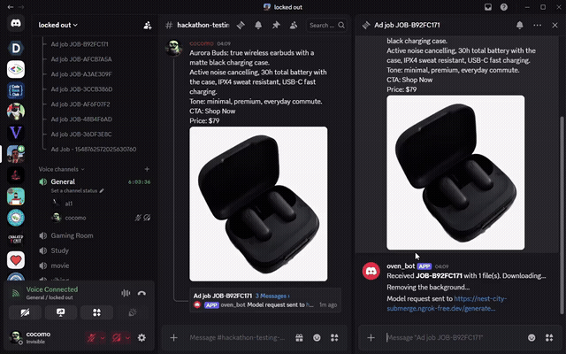
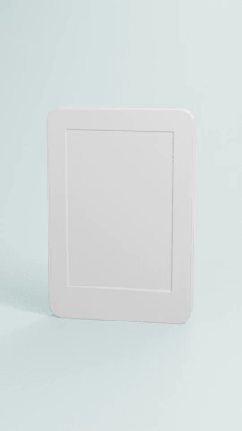

# oven_bot
**Multi App Agent Hackathon** — send a product photo to a Discord bot, get back ad creative (image or video) built through a real 3D pipeline: background removal → image-to-3D → Blender render → AI copy/judging → composited ad.

## Demo


Live run of the Discord bot: a seller message becomes an ad job, the image→GLB endpoint builds the 3D model, and the hero shots come back in-thread ([full-quality mp4 with audio](docs/demo.mp4)).

### Rendered ad sample


One video ad rendered end-to-end: photo → 3D model → animated studio render with a color tuned to the product → composited caption → encoded video ([full-quality mp4](docs/sample-ad.mp4)).

## Apps & services connected
| | Role |
|---|---|
| **Discord** | front end — upload photos in a channel, get ads back in a thread, reply to revise |
| **Blender** (MCP addon) | 3D scene, studio lighting/backdrop, still + video rendering |
| **Custom image→GLB endpoint** | photo → 3D model (`OVEN_MODEL_ENDPOINT`, default backend) |
| **Hyper3D Rodin** | alternate image→3D backend (optional, needs a key) |
| **Hugging Face / Ollama** | vision-language model: render judge, ad copywriter, video director agent |
| **LangGraph** | orchestrates the video director agent's script → render → revise loop |
| **rembg / OpenCV** | photo → transparent product cutout |
| **ffmpeg** | encodes rendered frames into the final mp4 |

## Setup
```
python -m venv .venv
.venv\Scripts\activate          # bash: source .venv/Scripts/activate
pip install -r requirements.txt
cp .env.example .env            # fill in DISCORD_TOKEN, OVEN_MODEL_ENDPOINT, etc.
```
- **Blender**: install the "MCP for Blender" addon, N-panel → **Connect** (port 9876).
- **3D model**: set `OVEN_MODEL_ENDPOINT` to your image→GLB endpoint (POST `{"image": base64(photo)}`, response body is the `.glb`). To use Hyper3D Rodin instead, tick it in the addon and set a key — it's available as `blender.generateModelHyper3d`.
- **VLM** (render judge / copywriter / video director), pick one via `OVEN_VLM_BACKEND`: `hf` (default, needs `HF_TOKEN`), `ollama` (offline, `ollama pull qwen3-vl:2b`), or `metrics` (no model, pixel checks only).
- First background removal downloads the rembg model once (~180 MB, cached in `~/.rembg`).

## Run
```
python -m bot
```
`OVEN_PIPELINE` picks the mode: `hero` (image ads), `video` (LangGraph director agent + Blender video ads), `dev` (no Blender, posts uploads back — for testing the Discord flow). Post one message with product photos (optionally a `.txt`/`.csv` spec sheet; the message text is the seller blurb) and the bot opens a thread. Replies in the thread (`approve`, `brighter`, `the model is wrong`, `use the 3d render`, ...) rerun only what they touch instead of the whole pipeline.

## Layout
```
prep/        photo → transparent PNG (rembg, OpenCV fallback)
blender/     Blender client + scene setup (customModel, hyper3d, studio, video, preview)
compose/     Pillow-only compositing (heroShot stills, videoOverlay captions/theme)
agent/       decisions: judge, copywriter, heroLoop, director (LangGraph video agent)
bot/         Discord front end + per-mode pipelines + job store
tests/       offline + live checks (botTest, composeTest, judgeTest, e2eTest, directorTest, ...)
```
`blenderScripts/*.py` run inside Blender via `client.runScript(path, args)`: the script gets `args`, defines `main(args)`, and its return value comes back as JSON.

## Test
```
python tests/botTest.py            # offline: routing, store, pipeline revisions with a fake Blender
python tests/composeTest.py        # offline: image compositing, writes out/hero/
python tests/directorTest.py       # offline: video script schema/validation
python tests/judgeTest.py          # offline gate/policy/copy checks
python tests/e2eTest.py --image headphones.jpeg   # full run against live Blender + Hyper3D
```
